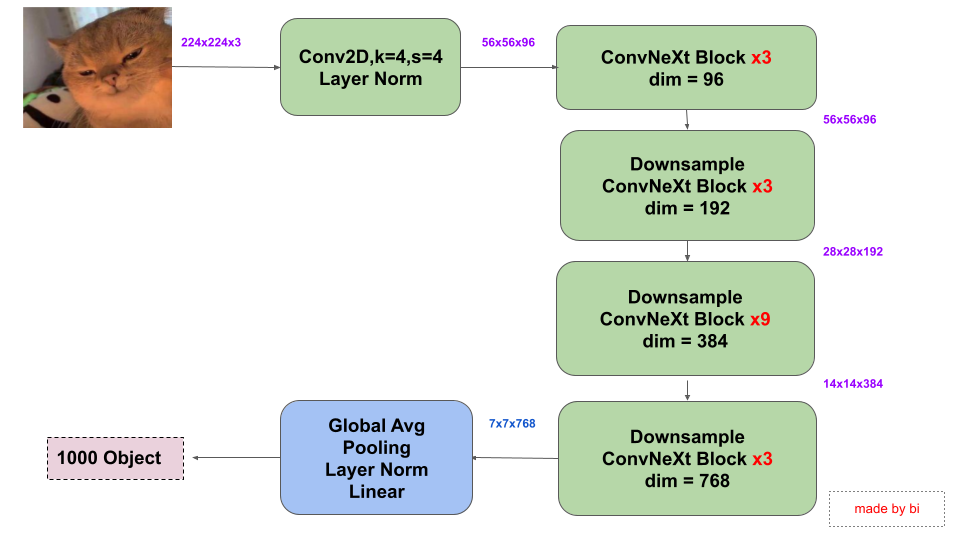

# ConvNeXt 2020s using Tensorflow

<p align="center">
    
</p>

Trong những năm qua, Transformer đã thường xuyên vượt qua CV. Lần đầu tiên nó bị Google ViT vượt qua trong phân loại hình ảnh và sau đó được Microsoft Swin Transformer giành chiến thắng trong lĩnh vực phát hiện đối tượng và phân đoạn hình ảnh. Khi ngày càng có nhiều học giả tham gia vào nghiên cứu trực quan Transformer. Tại thời điểm này, ConvNeXts là viết của Convolutional Neural Network tiêu chuẩn đã quay trở lại và lợi hại hơn xưa nhé :D


- Paper gốc : [A ConvNet for the 2020s](https://arxiv.org/abs/2201.03545)

- Translate VietNamese by me: [A ConvNet for the 2020s translate ](https://docs.google.com/document/d/10nPGRRUDybxll96e17RcDjnPkpTe2LfHWDWu7EWvpSQ/edit?usp=sharing)

- Bản tóm tắt ý chính của paper: [ConvNeXt 2020s sơ lược ](https://docs.google.com/document/d/1IoyAoVkJoccDNPd1csJ1SD3LWshVJb_sB1A3_ylDZf8/edit?usp=sharing)


Sơ đồ mô hình mạng ConvNeXt 2020s: 

<p align="center">

</p>

Review training on colab - Testing_library ConvNeXt-2020s.ipynb:

<a href="https://colab.research.google.com/drive/1f0w9hqypkrU12ggkD7q8EZMkfDAzEakj#scrollTo=oFrHbd-sR8Rv"> </a>


- Các paper liên quan cần đọc để hỗ trợ đọc hiểu paper trên : 
    - [ResNet-Deep Residual Learning for Image Recognition](https://arxiv.org/abs/1512.03385)
    - [MobileNets: Efficient Convolutional Neural Networks for Mobile Vision Applications](https://arxiv.org/abs/1704.04861)
    - [ResNetXt-Aggregated Residual Transformations for Deep Neural Networks](https://arxiv.org/abs/1611.05431)
    - [Vision Transformer](https://paperswithcode.com/method/vision-transformer)
    - [Swin Transformer](https://arxiv.org/abs/2103.14030)


Authors:
- Github: https://github.com/quynhtl
- Email: tranlequynh.uet@gmail.com

<!-- Advisors:

- Github: https://github.com/bangoc123
- Email: protonxai@gmail.com -->
<!-- Description about your project. Why do you choose to build this?  <--- **FIXME**

Slide about your project (if it's available) <--- **FIXME**

Architecture Image <--- **FIXME**


Advisors:
- Github: advisor github name <--- **FIXME**
- Email: advisor emails <--- **FIXME**

## I.  Set up environment
- Step 1: <--- **FIXME**

```python
conda env create -f environment.yml
```

- Step 2: <--- **FIXME**
```

```

- Step 3: <--- **FIXME**

```

``` 

## II.  Set up your dataset

- Guide user how to download your data and set the data pipeline <--- **FIXME**
- References: [NLP](https://github.com/bangoc123/transformer) and [CV](https://github.com/bangoc123/mlp-mixer)

## III. Training Process


**FIXME**

Training script:


```python

python train.py --epochs ${epochs} --input-lang en --target-lang vi --input-path ${path_to_en_text_file} --target-path ${path_to_vi_text_file}

```
**FIXME**

Example:

```python

!python train.py --train-folder ${train_folder} --valid-folder ${valid_folder} --num-classes 2 --patch-size 5 --image-size 150 --lr 0.0001 --epochs 200 --num-heads 12 

``` 
**FIXME**

There are some important arguments for the script you should consider when running it:

- `train-folder`: The folder of training data
- `valid-folder`: The folder of validation data
- ...

## IV. Predict Process

```bash
python predict.py --test-data ${link_to_test_data}
```

## V. Result and Comparision

**FIXME**

Your implementation
```
Epoch 7/10
782/782 [==============================] - 261s 334ms/step - loss: 0.8315 - acc: 0.8565 - val_loss: 0.8357 - val_acc: 0.7978
Epoch 8/10
782/782 [==============================] - 261s 334ms/step - loss: 0.3182 - acc: 0.8930 - val_loss: 0.6161 - val_acc: 0.8047
Epoch 9/10
782/782 [==============================] - 261s 333ms/step - loss: 1.1965 - acc: 0.8946 - val_loss: 3.9842 - val_acc: 0.7855
Epoch 10/10
782/782 [==============================] - 261s 333ms/step - loss: 0.4717 - acc: 0.8878 - val_loss: 0.4894 - val_acc: 0.8262

```

**FIXME**

Other architecture

```
Epoch 6/10
391/391 [==============================] - 115s 292ms/step - loss: 0.1999 - acc: 0.9277 - val_loss: 0.4719 - val_acc: 0.8130
Epoch 7/10
391/391 [==============================] - 114s 291ms/step - loss: 0.1526 - acc: 0.9494 - val_loss: 0.5224 - val_acc: 0.8318
Epoch 8/10
391/391 [==============================] - 115s 293ms/step - loss: 0.1441 - acc: 0.9513 - val_loss: 0.5811 - val_acc: 0.7875
```

Your comments about these results <--- **FIXME**


## VI. Running Test

When you want to modify the model, you need to run the test to make sure your change does not affect the whole system.

In the `./folder-name` **(FIXME)** folder please run:

```bash
pytest
``` -->


